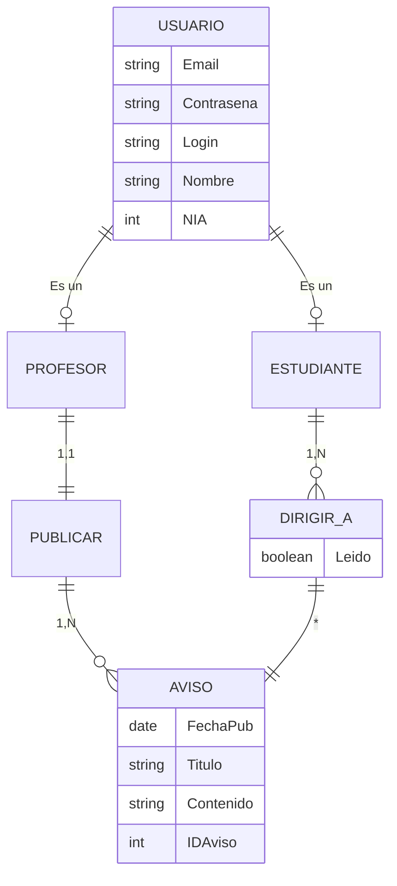

# TWEB Notificador de Avisos
En esta práctica académica realizada en el primer cuatrimestre del curso 2023-2024, saque una nota de 8,9/10.

## Diagrama Entidad-Relación de la Base de Datos de la aplicación

"Explícitamente, se mantiene qué aviso va dirigido a qué estudiante en la relación DIRIGIR_A."
