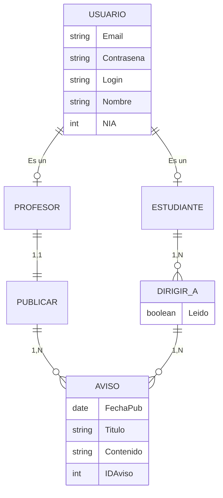
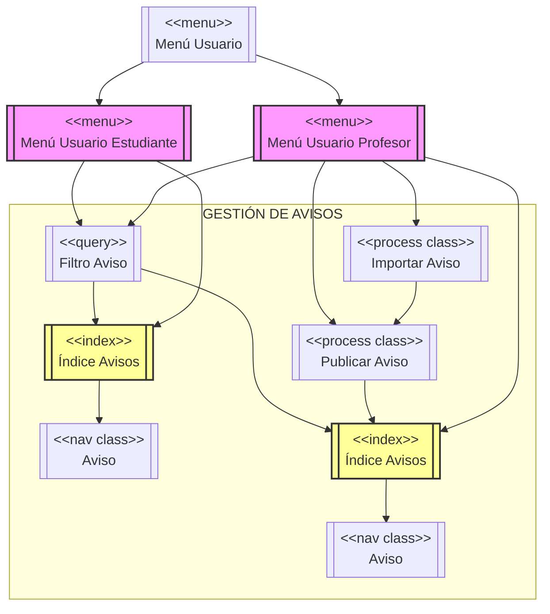
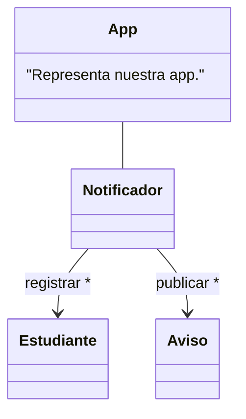

# [TECNOLOGÍAS WEB] Notificador de Avisos
En esta práctica académica realizada en el primer cuatrimestre del curso 2023-2024, obtuve una calificación de 8,9/10.
A continuación se mostrarán los diagramas realizados para el diseño de esta aplicación de notificación de avisos. El primer diagrama es un diagrama entidad-relación que modela el diseño conceptual de la base de datos que requiere la base de datos de la aplicación web, los otros dos diagramas son diagramas basados en la metodología UWE (UML-Based Web Engineering), la cual se utiliza para el diseño de aplicaciones web orientadas a servicios. Estos diagramas están enfocados en modelar tanto la estructura de la base de datos como las interacciones entre los usuarios y el sistema. A través de estos diagramas, se pretende visualizar de manera clara cómo los diferentes componentes de la aplicación interactúan entre sí y cómo se gestionan los avisos dentro de la plataforma.

## Diagrama Entidad-Relación de la Base de Datos de la aplicación
El diagrama entidad-relación presenta el modelo conceptual de la base de datos, describiendo las entidades principales (USUARIO, ESTUDIANTE, PROFESOR y AVISO) y sus relaciones. DIRIGIR_A es una relación entre ESTUDIANTE y AVISO que incluye un atributo Leido, indicando si el estudiante ha leído el aviso. El diagrama también muestra cómo los ESTUDIANTES reciben AVISOS, cómo la entidad USUARIO se divide en ESTUDIANTE y PROFESOR, con roles distintos en el sistema y el hecho de que el PROFESOR publica avisos en la plataforma para sus alumnos (representado en la relación PUBLICAR).



"(En la relación "DIRIGIR_A") Explícitamente, se mantiene qué aviso va dirigido a qué estudiante."

| IDAviso | IDAlumno |
|---------|----------|
|    1    |    1     |
|    2    |    1     |
|    2    |    2     |

## Diagramas UWE
Los diagramas UWE se utilizan para diseñar aplicaciones web mediante la representación de clases y sus interacciones dentro del sistema. Esta metodología facilita la creación de aplicaciones web de manera estructurada y organizada, abordando tanto las interfaces como la lógica de negocio.

### Diagrama de navegación UWE
El diagrama de navegación UWE describe la estructura de navegación dentro de una aplicación web. Este modelo es útil para representar cómo los usuarios pueden moverse entre las diferentes partes de la aplicación, conectando los componentes de contenido y procesamiento de manera coherente. A continuación, detallo su aplicación en el diseño de la solución:
UWE propone otro modelo interesante, el modelo de navegabilidad, que es útil para representar cómo navegar dentro de la app, introduciendo componentes de navegabilidad: menús, índices, y procesos, que luego se traduce en componentes HTML concretos (por ejemplo, un menú aquí se traducirá en una barra de navegación HTML, es decir, en una lista (```<ul>```), cuyos elementos (```<li>```) son enlaces (```<a>```), asociados a cada opción del menú), y permite distribuir la navegabilidad entre las diferentes acciones, ya sean de contenido o de procesamiento.
En la app hay tres grandes paquetes funcionales:

- Gestión de usuarios (login, restablecer contraseña, logout...).
- Gestión de estudiantes (registrar estudiante, ...).
- Gestión de avisos (publicar aviso, importar avisos, leer aviso, ...).

Las funcionalidades están distribuidas entre ambos perfiles de usuario. Basándonos en el modelo de contenido (específicamente en lo relacionado con los avisos, si nos enfocamos en la gestión de estos), una posible representación de la navegabilidad sería:



#### Nota adicional:
"Este diagrama puede completarse incluyendo acciones de cada perfil para la gestión de Estudiantes dentro del menú correspondiente y acciones de la gestión de usuarios dentro del menú de usuario."

### Diagrama de clases UWE
Este diagrama describe las clases principales del sistema y sus relaciones. Se visualizan los actores involucrados, como el Notificador, que es responsable de gestionar los avisos, y las clases de usuario como Estudiante. Las clases muestran sus métodos y atributos, reflejando cómo interactúan dentro de la aplicación. Además, el diagrama incluye las relaciones entre las clases, como la acción de registrar o publicar, lo que permite ver cómo los usuarios y los avisos interactúan con el sistema.

#### DIAGRAMA MODELO CONTENIDO (Metodología UWE)
A partir del diagrama E-R considerado, podemos considerar que nuestra app debe gestionar/presentar contenido sobre **usuarios** (en particular, estudiantes) y **avisos**, lo cual puede representarse mediante el siguiente diagrama de clases:


## Conclusión

Este proyecto refleja un enfoque estructurado y metódico en el diseño y desarrollo de aplicaciones web orientadas a servicios. A través del uso de diagramas E-R y la metodología UWE, se ha logrado visualizar cómo interactúan los diferentes componentes del sistema, facilitando la implementación y el mantenimiento del mismo. La calificación obtenida en esta práctica es un reflejo del esfuerzo invertido y del aprendizaje adquirido.
## Agradecimientos

Agradezco a mis profesores y compañeros por su apoyo y orientación durante el desarrollo de esta práctica. Sus aportes han sido fundamentales para el éxito de este proyecto.
## Contribuciones

Si deseas contribuir a este proyecto, no dudes en hacer un fork del repositorio, proponer mejoras o reportar problemas. ¡Toda ayuda es bienvenida!
## Contacto

Para cualquier consulta o comentario sobre este proyecto, puedes contactarme a través de mi perfil de GitHub.
