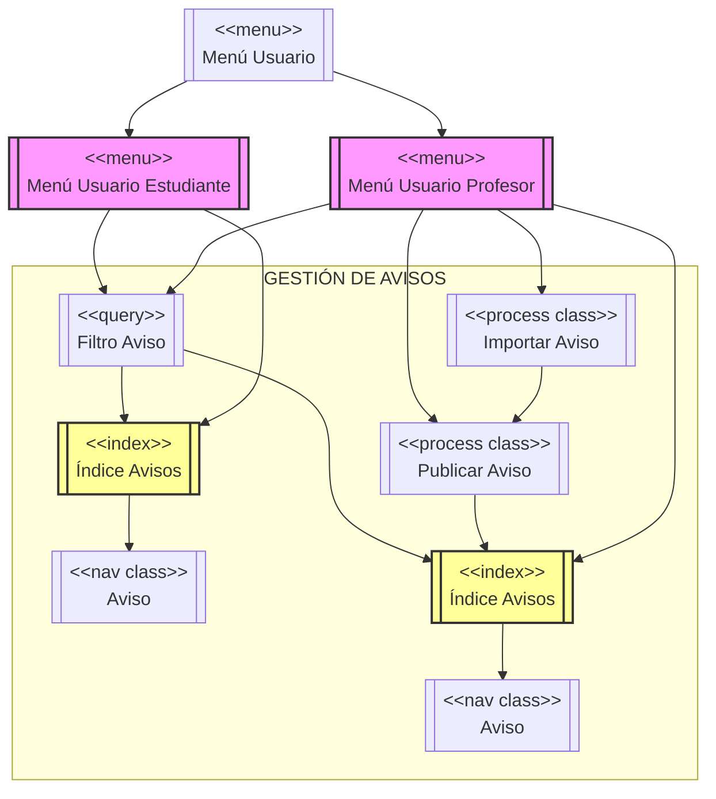
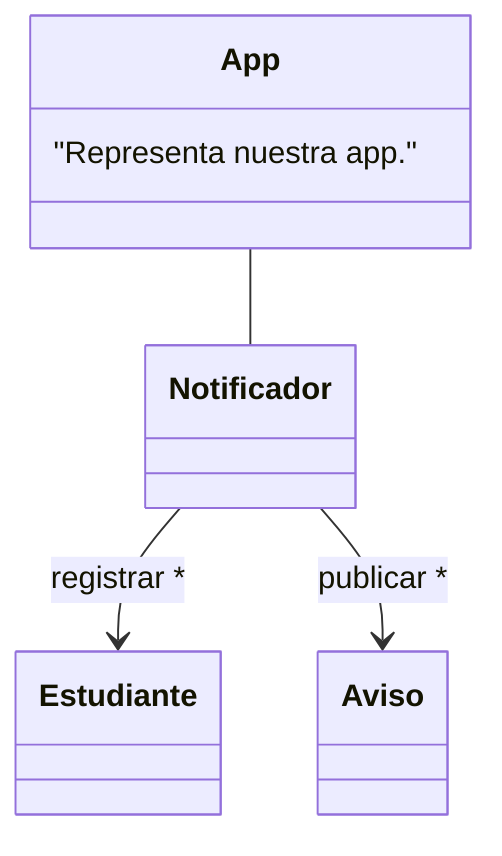

# TWEB Notificador de Avisos
En esta práctica académica realizada en el primer cuatrimestre del curso 2023-2024, saque una nota de 8,9/10.
A continuación se mostrarán los diagramas realizados para el diseño de esta aplicación de notificación de avisos.

## Diagrama Entidad-Relación de la Base de Datos de la aplicación

```mermaid
erDiagram
    USUARIO {
        string Email
        string Contrasena
        string Login
        string Nombre
        int NIA
    }
    %% Relación jerárquica
    USUARIO ||--o| PROFESOR : "Es un"
    USUARIO ||--o| ESTUDIANTE : "Es un"

    PROFESOR ||--|| PUBLICAR : "1,1"
    PUBLICAR ||--o{ AVISO : "1,N"

    ESTUDIANTE ||--o{ DIRIGIR_A : "1,N"
    DIRIGIR_A ||--o{ AVISO : "1,N"
    DIRIGIR_A \(*\) {
        boolean Leido
    }

    AVISO {
        date FechaPub
        string Titulo
        string Contenido
        int IDAviso
    }
```

"(*) Explícitamente, se mantiene qué aviso va dirigido a qué estudiante en la relación (DIRIGIR_A)."

| IDAviso | IDAlumno |
|---------|----------|
|    1    |    1     |
|    2    |    1     |
|    2    |    2     |

## Diagrama de navegación UWE
UWE propone otro modelo interesante, el modelo de navegabilidad, que es útil para representar cómo navegar dentro de la app, introduciendo componentes de navegabilidad: menús, índices, y procesos, que luego se traduce en componentes HTML concretos (por ejemplo, un menú aquí se traducirá en una barra de navegación HTML, es decir, en una lista (```<ul>```)), cuyos elementos (```<li>```) son enlaces (```<a>```), asociados a cada opción del menú), y permite distribuir la navegabilidad entre las diferentes acciones, ya sean de contenido o de procesamiento.
En la app hay tres grandes paquetes funcionales:

- Gestión de usuarios (login, restablecer contraseña, logout...).
- Gestión de estudiantes (registrar estudiante, ...).
- Gestión de avisos (publicar aviso, importar avisos, leer aviso, ...).

Cuyas funcionalidades están repartidas entre los dos perfiles de usuario. Partiendo del modelo de contenido (en lo que se atañe a avisos, si nos ceñimos a la gestión de avisos) una posible representación de la navegabilidad podría ser:



### Nota adicional:
"Este diagrama puede completarse incluyendo acciones de cada perfil para la gestión de Estudiantes dentro del menú correspondiente y acciones de la gestión de usuarios dentro del menú de usuario."

## Diagrama de clases UWE
### DIAGRAMA MODELO CONTENIDO (Metodología UWE)
A partir del diagrama E-R considerado, podemos considerar que nuestra app debe gestionar/presentar contenido sobre **usuarios** (en particular, estudiantes) y **avisos**, lo cual puede representarse mediante el siguiente diagrama de clases:


